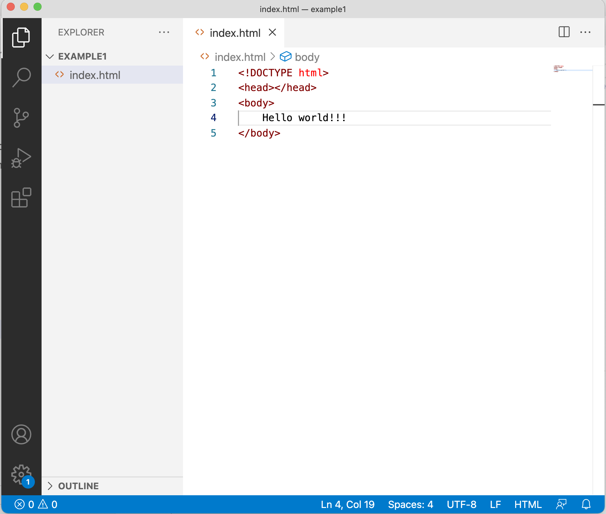
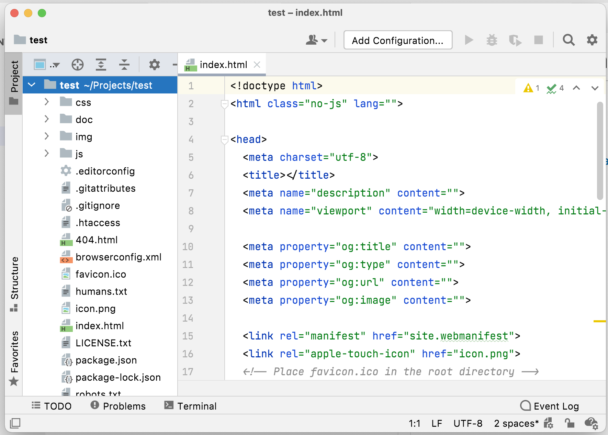
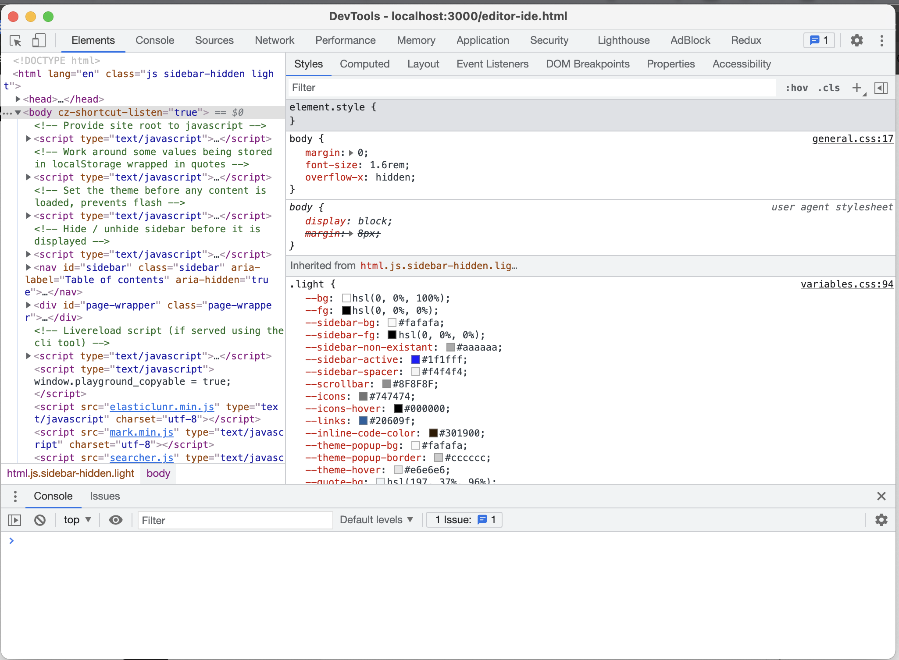

# Naudojami įrankiai

* Visual studio code
  

Atsisiuntimo nuoroda: [Visual Studio Code](https://code.visualstudio.com/) 

* WebStorm

Atsisiuntimo nuoroda: [WebStorm](https://www.jetbrains.com/webstorm/)

* Chrome su Develepor tools

Jau turite kartu su chrome web naršykle (tiesiog paspaukite F12)