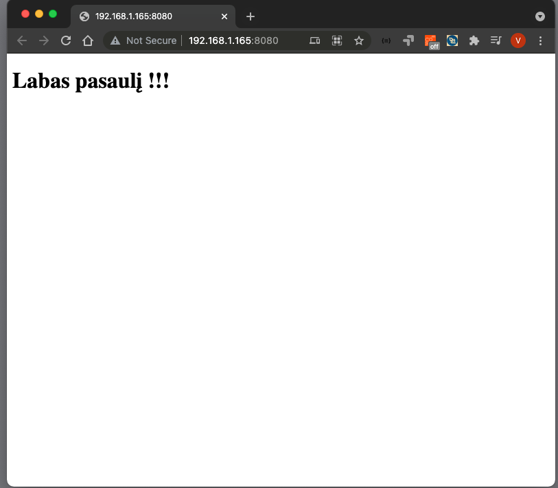

# Užduotis 2

* Sukurkite naują failą su .html plėtiniu. Galite pasirinkti bet kokį pavadinimą, nors įprasta jį pavadinti index.html.
* Atidarykite failą naudodami bet kurį teksto redaktorių. Net "Notepad" tam tiks, tačiau bus lengviau ir tikrai patogiau, jei naudosite kažką labiau pritaikyto programuotojams, pvz., "Visual Studio Code", "WebStorm IDE".
* Parašykite savo pirmąjį HTML kodą! Sukurkite paprastą HTML struktūrą naudodami `<html>`, `<head>`, `<title>` ir `<body>` žymas (ang. tag), kurias jau aptaremė.
* Prie žymos (ang. tag) <body> pridėkite šią žymą (ang. tag): `<h1> Labas pasaulis! </h1>` .
* Atidarykite failą naudodami bet kurią naršyklę ir pažiūrėkite, kas atsitiks!
* Galite taip pat idėti failą į prieš tai sukurtą `C:\www` direktoriją ir paleidus **serve.exe** atidaryti [http://localhost:8080](http://localhost:8080)

