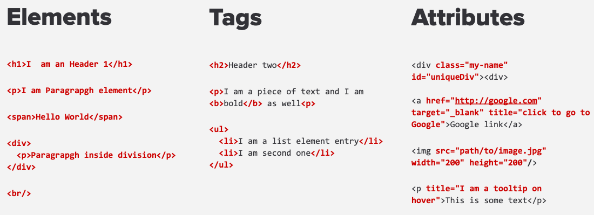

# Tags ir atributai


---

* HTML susideda iš žymių (ang. tags), parašytų gana paprastu formatu:

```html
<tag>content...</tag>
```

* Kai kuriose žymose nėra turinio, todėl jos užsidaro savaime:

```html
<tag />
```

* Kai kurios žymos taip pat turi atributus perduoti duomenis elementui:

```html
<tag attribute-name="attribute-value">content...</tag>
```
---

